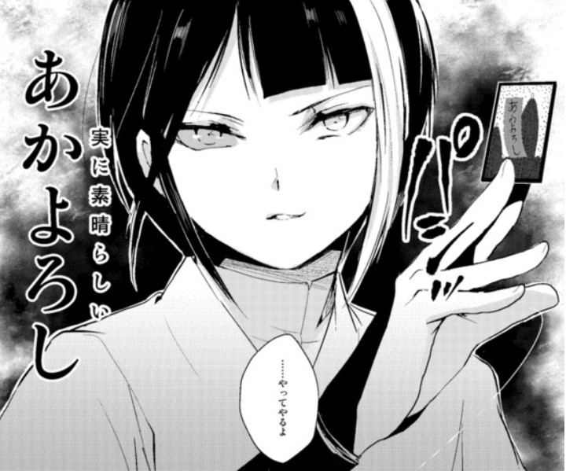

<progress class="progress is-warning" value="90" max="100"></progress>

## Prologue

来到日本已经快半年了。blog的更新一直在搁置状态中，搬家，熟悉周围环境以及工作的原因，导致我一直想更新blog都有些力不从心了。

最近差不多有些稳定下来了，所以就打算把之前漏掉的一些地方进行修改，顺便记录来到日本之后的生活。

<!-- more -->

## 赴日后的三个月

> 重要的是过程，但是过程无聊且辛苦

刚来到日本的时候，一切都是那么新鲜，但是也没有熟人接应，一切都是陌生的。公司的宿舍在团地中，类似国内的小区，楼下有一家罗森便利店，走路十分钟ario商场，里面的伊藤洋华堂是经常买菜的地方。

### 关于工作

一月份去了新现场，但是刚入场的时候得了牙髓炎...算是给了我致命一击，好在楼下有家牙科诊所，结果居然是曾经根管治疗的一颗牙，没有治好还把旁边的牙弄坏了。没办法只好开启漫长的治牙之路。关于这部分之后会整理出来。

关于工作没什么好说的，自日本，IT不是IT，而是服务，翻来覆去就那么几家公司，还都不是什么高技术的。所以来到这里后算是看开了。重要的是生活。

不过好在是个不怎么加班的工作，准点下班的次数远多于加班的次数。而且从三月份开始开始担任leader的职务，虽然没什么经验，但是也是希望尽快完成心态和角色的转变吧。

### 部会

3月29号的晚上，部门会议结束后部长组织去了中华料理店，在晚会上，大家还是比较生疏，毕竟工作的地点其实不固定，更多的是在家远程或者去现场，平时见面的机会几乎没有。而且我的日语水平仅仅是自学程度，勉勉强强能够对话。

虽然是中华料理，但是味道比不上国内的，有种味噌的味道，猪肉还是有股腥味。但是部里的日本人倒是挺喜欢吃的。

当然按照惯例，新人还是去和管理层的人敬酒混个脸熟的。无非就是自我介绍然后说请多关照等等。可以说有种很强的既视感了。

## Epilogue

**压力**还是会有一些的，4月份会来一批新员工，很多是日本的应届生，看介绍给我看出一身冷汗，不仅有筑波大学，庆应义塾，早稻田的学生，还有东京大学的...当然现在我的小组里有个qs30学校毕业的...和清华大学不相上下了。我一个末流985的不敢吱声。`ヽ(*。>Д<)o゜)`

<article class="message is-warning">

 即使如此，没能读研依旧是我不能释怀的事.

</article>

###  关于图片

牌中的日文是【あのよろし】，但是却读作【<ruby>あかよろし<rt>a no yo ro shi</rt></ruby>】，这里的`の`读作`か`,意思是“精彩（斯巴拉西）”。

